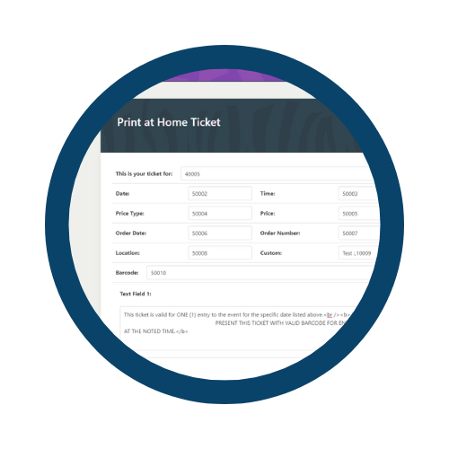

# Event CMS

  

Built with Django and Vue, Event CMS is a management application to add, edit, and track events to easily manage and later create in our point-of-sale system.

 
Replacing a previous system of Word documents, editing or creating an event is streamlined.

 
A separate app (Ticket) is available to build the ticket PDF template which pulls custom fields from the point-of-sale.
